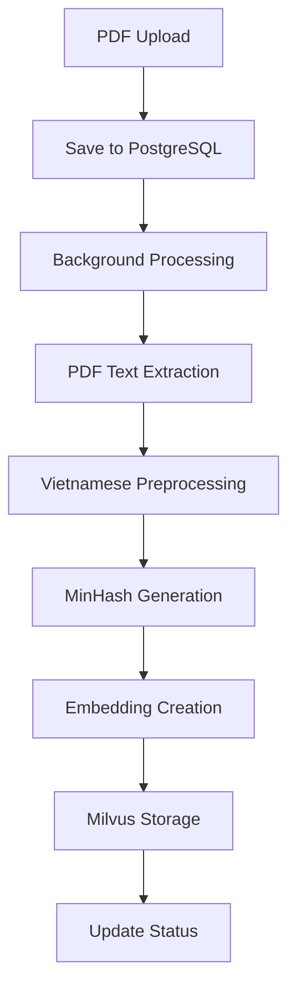
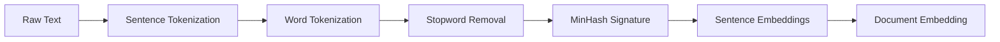
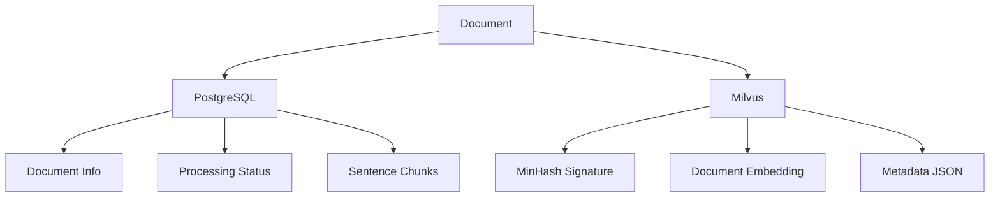

# 🎯 Plagiarism Detection System

Hệ thống kiểm tra đạo văn sử dụng MinHash và Vector Database với FastAPI, Milvus và PostgreSQL.

## 📋 Tổng quan

### 🎯 Mục tiêu
- Xây dựng hệ thống plagiarism detection hiệu quả
- Sử dụng MinHash cho lọc sơ bộ (coarse filtering)
- Sử dụng embeddings cho similarity detection chính xác
- Hỗ trợ tiếng Việt với model embedding chuyên dụng

### 🏗️ Kiến trúc
```
┌─────────────────┐    ┌──────────────────┐    ┌─────────────────┐
│   FastAPI       │    │   Milvus         │    │   PostgreSQL    │
│   (API Layer)   │◄──►│   (Vector DB)    │◄──►│   (Metadata)    │
└─────────────────┘    └──────────────────┘    └─────────────────┘
         │                       │                       │
         ▼                       ▼                       ▼
┌─────────────────┐    ┌──────────────────┐    ┌─────────────────┐
│  PDF Processor  │    │  MinHash         │    │  Document Info  │
│  (PyPDF2)       │    │  (datasketch)    │    │  (Status, etc)  │
└─────────────────┘    └──────────────────┘    └─────────────────┘
         │                       │                       │
         ▼                       ▼                       ▼
┌─────────────────┐    ┌──────────────────┐    ┌─────────────────┐
│ Text Preprocess │    │ Embedding Model  │    │  Sentence Data  │
│ (underthesea)   │    │ (DEk21_hcmute)   │    │  (Chunks)      │
└─────────────────┘    └──────────────────┘    └─────────────────┘
```

## 🚀 Tech Stack

### **Backend Framework**
- **FastAPI**: REST API framework
- **Uvicorn**: ASGI server

### **AI/ML Libraries**
- **Sentence Transformers**: Text embeddings
- **DEk21_hcmute_embedding**: Vietnamese embedding model (768 dims)
- **datasketch**: MinHash implementation
- **underthesea**: Vietnamese NLP toolkit

### **Databases**
- **Milvus**: Vector database (cosine similarity, 768 dims)
- **PostgreSQL**: Metadata storage

### **Text Processing**
- **PyPDF2**: PDF text extraction
- **Vietnamese tokenization**: Word segmentation
- **Stopword removal**: Vietnamese stopwords

## 📊 Luồng xử lý (Processing Flow)

### **1. Document Upload**


### **2. Text Processing Pipeline**


### **3. Storage Strategy**


## 🔧 Installation & Setup

### **Prerequisites**
```bash
# Python 3.8+
# PostgreSQL
# Milvus
# Git
```

### **Installation**
```bash
# Clone repository
git clone https://github.com/quangtrung216/plagiarism_test.git
cd plagiarism_test

# Create virtual environment
python -m venv venv
source venv/bin/activate  # Linux/Mac
venv\Scripts\activate     # Windows

# Install dependencies
pip install -r requirements.txt
```

### **Database Setup**
```bash
# PostgreSQL (default config)
Host: localhost
Port: 15432
Database: plagiarism_detection
User: plagiarism
Password: plagiarism

# Milvus (default config)
Host: localhost
Port: 19530
```

## 🚀 Usage

### **Start API Server**
```bash
# Method 1: Using main.py
python main.py

# Method 2: Using uvicorn directly
uvicorn api.pdf_upload_api:app --reload --host 0.0.0.0 --port 8000
```

### **API Endpoints**

#### **Upload PDF**
```bash
curl -X POST "http://localhost:8000/upload-pdf" \
  -F "file=@document.pdf" \
  -F "title=Document Title" \
  -F "author=Author Name" \
  -F 'metadata={"tags":["research","ai"]}'
```

#### **Check Document Status**
```bash
curl http://localhost:8000/document-status/1
```

#### **Get Document Details**
```bash
curl http://localhost:8000/document/1
```

#### **Health Check**
```bash
curl http://localhost:8000/health
```

#### **API Documentation**
```
http://localhost:8000/docs
```

## 📊 Data Models

### **Milvus Collection Schema**
```json
{
  "name": "plagiarism_docs_2024",
  "description": "Plagiarism detection collection (dim=768, metric=COSINE)",
  "fields": [
    {"name": "id", "type": "INT64", "is_primary": true},
    {"name": "subject_id", "type": "INT64"},
    {"name": "minhash", "type": "VARCHAR", "max_length": 64},
    {"name": "content_vector", "type": "FLOAT_VECTOR", "dim": 768},
    {"name": "metadata", "type": "JSON"}
  ]
}
```

### **PostgreSQL Tables**
```sql
-- Documents table
CREATE TABLE documents (
    id SERIAL PRIMARY KEY,
    title VARCHAR(500) NOT NULL,
    author VARCHAR(200),
    subject_id INTEGER DEFAULT 1,
    status VARCHAR(50) DEFAULT 'pending',
    total_sentences INTEGER DEFAULT 0,
    processed_sentences INTEGER DEFAULT 0,
    vector_count INTEGER DEFAULT 0,
    error_message TEXT,
    metadata JSONB,
    minhash_signature VARCHAR(1000),
    created_at TIMESTAMP DEFAULT NOW()
);

-- Sentences table
CREATE TABLE sentences (
    id SERIAL PRIMARY KEY,
    document_id INTEGER REFERENCES documents(id),
    sentence_number INTEGER,
    original_text TEXT,
    processed_text TEXT,
    word_count INTEGER,
    page_number INTEGER
);
```

## 🔍 Key Features

### **✅ Implemented**
- [x] PDF upload and processing
- [x] Vietnamese text preprocessing
- [x] MinHash signature generation
- [x] Embedding creation (768 dims)
- [x] Milvus vector storage
- [x] PostgreSQL metadata storage
- [x] Background processing
- [x] Error handling and logging
- [x] API documentation

### **🚧 In Progress**
- [ ] Plagiarism similarity search
- [ ] Document comparison API
- [ ] Batch processing
- [ ] Performance optimization

### **📋 Planned**
- [ ] Real-time plagiarism detection
- [ ] Multi-language support
- [ ] Advanced similarity algorithms
- [ ] Dashboard UI
- [ ] Export reports

## 🧪 Testing

### **Unit Tests**
```bash
# Test preprocessing
python debug_preprocessing.py

# Test Milvus upload
python test_milvus_upload.py

# Check data
python check_milvus_data.py
python check_document_status.py
```

### **Integration Tests**
```bash
# Upload test document
curl -X POST "http://localhost:8000/upload-pdf" \
  -F "file=@test.txt" \
  -F "title=Test Document"

# Check processing
curl http://localhost:8000/document-status/1
```

## 🔧 Configuration

### **Environment Variables**
```bash
# PostgreSQL
POSTGRES_HOST=localhost
POSTGRES_PORT=15432
POSTGRES_DB=plagiarism_detection
POSTGRES_USER=plagiarism
POSTGRES_PASSWORD=plagiarism

# Milvus
MILVUS_HOST=localhost
MILVUS_PORT=19530
MILVUS_ALIAS=default

# HuggingFace (optional)
HF_TOKEN=your_token_here
```

## 📈 Performance

### **Current Metrics**
- **Embedding Model**: DEk21_hcmute_embedding (768 dimensions)
- **Vector DB**: Milvus with COSINE similarity
- **Processing Speed**: ~1-2 seconds per document
- **MinHash**: 128 permutations
- **Min Words Threshold**: 2 words per sentence

### **Optimization Tips**
- Increase Milvus batch size for bulk uploads
- Use GPU for embedding generation
- Implement caching for repeated documents
- Optimize MinHash parameters for your dataset

## 🐛 Troubleshooting

### **Common Issues**

#### **1. "No data found in Milvus"**
```bash
# Check collection status
python check_milvus_data.py

# Load collection manually
python debug_milvus_insert.py
```

#### **2. "Document status pending"**
```bash
# Check PostgreSQL status
python check_document_status.py

# Look for error messages
SELECT * FROM documents WHERE status = 'failed';
```

#### **3. "Vietnamese preprocessing issues"**
```bash
# Debug text processing
python debug_preprocessing.py

# Adjust min_words threshold
# Edit: text_process/preprocessor.py
```

#### **4. "Model loading errors"**
```bash
# Check HuggingFace connection
pip install --upgrade sentence-transformers

# Use fallback model
# Edit: service/document_service.py
```

## 🤝 Contributing

1. Fork the repository
2. Create feature branch (`git checkout -b feature/amazing-feature`)
3. Commit changes (`git commit -m 'Add amazing feature'`)
4. Push to branch (`git push origin feature/amazing-feature`)
5. Open Pull Request

## 📄 License

This project is licensed under the MIT License - see the [LICENSE](LICENSE) file for details.

## 🙏 Acknowledgments

- **DEk21_hcmute_embedding**: Vietnamese embedding model from HCMUTE
- **underthesea**: Vietnamese NLP toolkit
- **datasketch**: MinHash implementation
- **Milvus**: Vector database
- **FastAPI**: Modern web framework

## 📞 Contact

- **Repository**: https://github.com/quangtrung216/plagiarism_test
- **Issues**: https://github.com/quangtrung216/plagiarism_test/issues

---

**🚀 Happy Coding! Check for plagiarism responsibly!**
