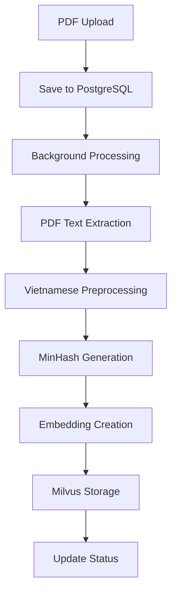

# 🎯 Plagiarism Detection System

Hệ thống kiểm tra đạo văn sử dụng MinHash và Vector Database với FastAPI, Milvus và PostgreSQL.

## 📋 Tổng quan

### 🎯 Mục tiêu
- Xây dựng hệ thống plagiarism detection hiệu quả
- Sử dụng MinHash cho lọc sơ bộ (coarse filtering)
- Sử dụng embeddings cho similarity detection chính xác
- Hỗ trợ tiếng Việt với model embedding chuyên dụng

### 🏗️ Kiến trúc
```
┌─────────────────┐    ┌──────────────────┐    ┌─────────────────┐
│   FastAPI       │    │   Milvus         │    │   PostgreSQL    │
│   (API Layer)   │◄──►│   (Vector DB)    │◄──►│   (Metadata)    │
└─────────────────┘    └──────────────────┘    └─────────────────┘
         │                       │                       │
         ▼                       ▼                       ▼
┌─────────────────┐    ┌──────────────────┐    ┌─────────────────┐
│  PDF Processor  │    │  MinHash         │    │  Document Info  │
│  (PyPDF2)       │    │  (datasketch)    │    │  (Status, etc)  │
└─────────────────┘    └──────────────────┘    └─────────────────┘
         │                       │                       │
         ▼                       ▼                       ▼
┌─────────────────┐    ┌──────────────────┐    ┌─────────────────┐
│ Text Preprocess │    │ Embedding Model  │    │  Sentence Data  │
│ (underthesea)   │    │ (DEk21_hcmute)   │    │  (Chunks)      │
└─────────────────┘    └──────────────────┘    └─────────────────┘
```

## 🚀 Tech Stack

### **Backend Framework**
- **FastAPI**: REST API framework
- **Uvicorn**: ASGI server

### **AI/ML Libraries**
- **Sentence Transformers**: Text embeddings
- **DEk21_hcmute_embedding**: Vietnamese embedding model (768 dims)
- **datasketch**: MinHash implementation
- **underthesea**: Vietnamese NLP toolkit

### **Databases**
- **Milvus**: Vector database (cosine similarity, 768 dims)
- **PostgreSQL**: Metadata storage

### **Text Processing**
- **PyPDF2**: PDF text extraction
- **Vietnamese tokenization**: Word segmentation
- **Stopword removal**: Vietnamese stopwords

## 📊 Luồng xử lý (Processing Flow)

### **1. Document Upload**

